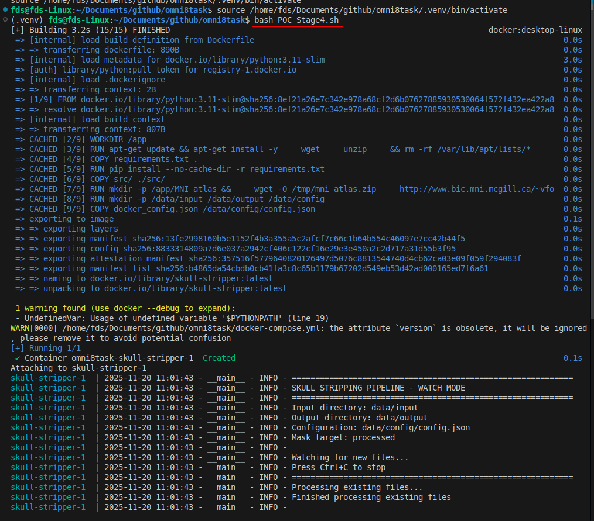
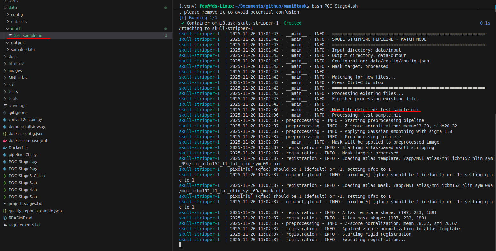
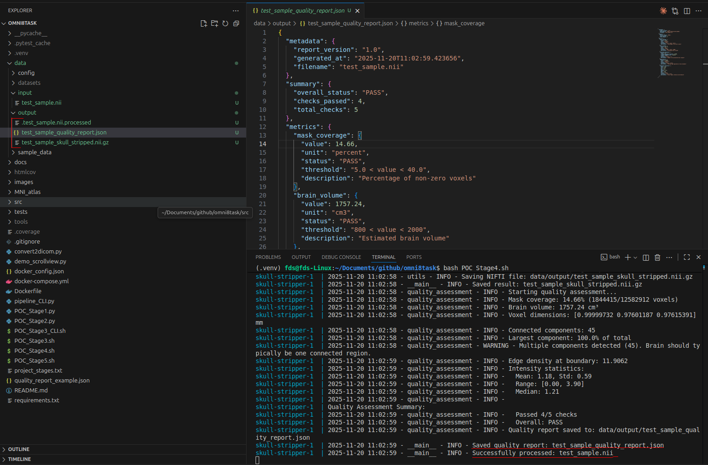
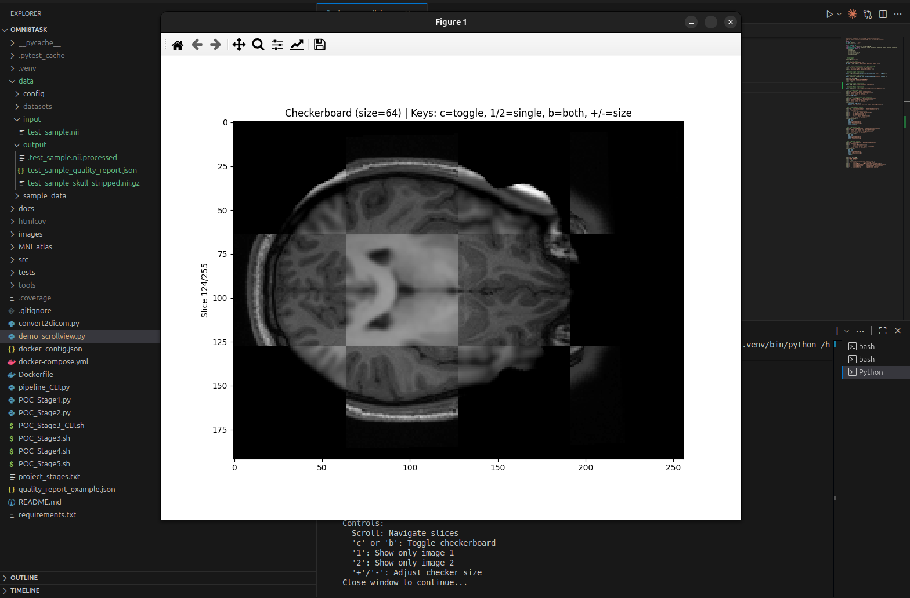
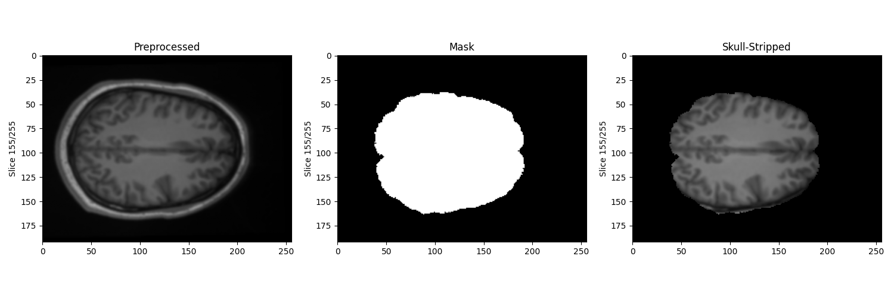
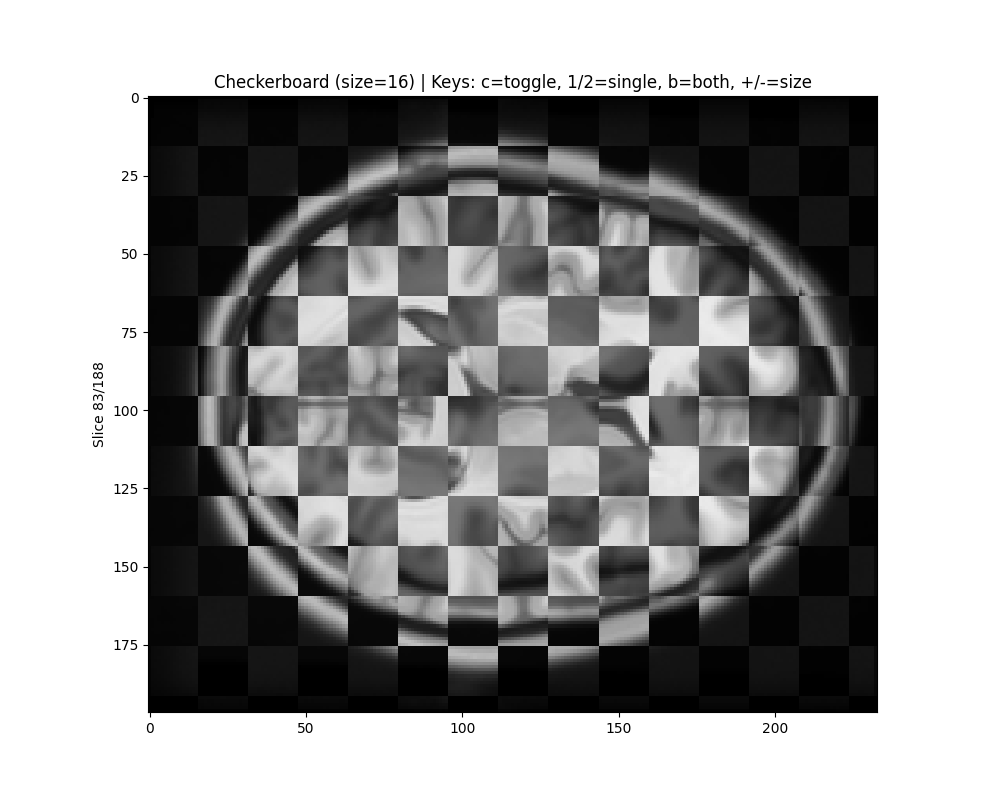
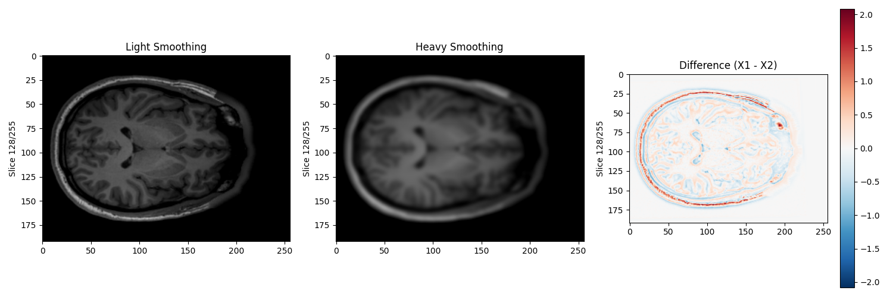
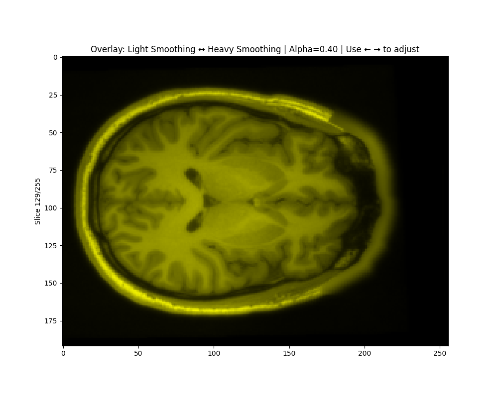

# MRI Skull Stripping Pipeline
> Atlas-based brain extraction within the context of neurological MRI preprocessing

[](https://www.python.org/downloads/)
[](https://opensource.org/licenses/MIT)

## Overview

This project is a production-ready Python pipeline for automated skull stripping of T1-weighted MRI scans using atlas-based registration. This tool implements preprocessing, registration, and quality assessment workflows. With a functional docker deployment, for immidate use in a production context.

**Key Features:**
- Atlas-based skull stripping using MNI152 template
- Flexible preprocessing (Z-score/min-max normalization, Gaussian smoothing)
- Rigid and affine registration options
- Automated quality assessment with JSON reports
- Interactive and lightweight visualization tools
- Complete Docker integration for production deployment
- Comprehensive unit tests

---

## Table of Contents

- [Overview](#overview)
- [Installation](#installation)
  - [Prerequisites](#prerequisites)
  - [Setup](#setup)
- [Docker Deployment](#docker-deployment)
  - [Production Context](#production-context)
  - [Workflow Integration](#workflow-integration)
  - [Running the Container](#running-the-container)
- [CLI Usage](#cli-usage)
- [Usage](#usage)
  - [Single File Processing](#single-file-processing)
  - [Batch Processing](#batch-processing)
  - [Watch Mode](#watch-mode)
- [Pipeline Architecture](#pipeline-architecture)
- [Development Approach](#development-approach)
  - [Stage 1: Core Pipeline](#stage-1-core-pipeline)
  - [Stage 2: Registration](#stage-2-registration)
  - [Stage 3: CLI & Integration](#stage-3-cli--integration)
  - [Stage 4: Docker Integration](#stage-4-docker-integration)
  - [Stage 5: Testing & Documentation](#stage-5-testing--documentation)
- [Pipeline Implementation](#pipeline-implementation)
- [Quality Assessment](#quality-assessment)
- [Visualization](#visualization)
- [Testing](#testing)
- [Assumptions & Design Decisions](#assumptions--design-decisions)
- [Potential Improvements](#potential-improvements)
- [AI Usage Disclosure](#ai-usage-disclosure)
- [Sample Data](#sample-data)
- [Troubleshooting](#troubleshooting)
- [Citation](#citation)
- [Contact](#contact)
- [Acknowledgments](#acknowledgments)

---

## Installation

### Prerequisites
- Python 3.11 or higher

### Setup

1. **Clone the repository:**
```bash
git clone <repository-url>
cd omni8task
```

2. **Install dependencies:**
```bash
pip install -r requirements.txt
```
See [requirements.txt](requirements.txt) for the full list of dependencies.

3. **MNI152 atlas:**
A stripped down version of the atlas exists within the repository (T1 Brain Only) 
If the entire atlas is required see following commands and point the config to the unzip location: 

```bash
mkdir -p MNI_atlas
cd MNI_atlas
wget http://www.bic.mni.mcgill.ca/~vfonov/icbm/2009/mni_icbm152_nlin_sym_09a_nifti.zip
unzip mni_icbm152_nlin_sym_09a_nifti.zip
cd ..
```

---

## Docker Deployment

### Production Context

In clinical environments, MRI processing pipelines need to run continuously and reliably across different hospital IT infrastructures. Docker is very useful for this purpose.

**Infrastructure independence:** Docker ensures the pipeline runs identically everywhere without dependency conflicts or manual configuration.(Windows servers, Linux clusters, cloud VMs)

**Continuous processing:** Users produce images throughout the day. The watch mode container monitors an input directory and automatically processes new scans as they arrive - no manual intervention needed.

**Isolation and safety:** Medical systems require strict separation from other hospital IT. Containerization provides process isolation, preventing pipeline failures from affecting other systems and vice versa.

**Easy deployment:** A single `docker compose up` command deploys the entire pipeline. IT departments can integrate this into their PACS/RIS infrastructure without installing Python, dependencies, or downloading atlases manually.

### Workflow Integration

A typical deployment scenario:
1. IT mounts a shared network drive to `/data/input`
2. Users save scans to this directory (standard PACS export)
3. Docker container detects new files and processes automatically
4. Results appear in `/data/output` for clinicians or downstream systems
5. Container logs provide audit trail for quality assurance

This eliminates the batch processing bottleneck - scans are processed as soon as they arrive rather than waiting for someone to manually trigger batch jobs.

### Running the Container

**Plug and Play:**
```bash
bash POC_Stage4.sh
```
See [POC_Stage4.sh](POC_Stage4.sh) for the complete deployment script.

This script demonstrates the default configuration running in watch mode. The container will:
- Process any existing scans in `./data/input`
- Continue monitoring for new files
- Save results to `./data/output`
- Generate quality reports for each scan

**Configuration:**
The [docker-compose.yml](docker-compose.yml) and [docker_config.json](docker_config.json) files define the default behavior. Modify these to adjust preprocessing parameters, atlas location, or enable/disable watch mode.

**Image details:**
- Base: Python 3.11-slim (minimal footprint)
- MNI152 atlas downloaded during build (no runtime dependencies)
- Restarts automatically if crashed (production reliability)

See [Dockerfile](Dockerfile) for build details and [docker-compose.yml](docker-compose.yml) for service configuration.

### Example Images










---

## CLI Usage

Process a single MRI scan:
```bash
python pipeline_CLI.py \
  --input data/sample_data/test_sample.nii \
  --output results/brain_extracted.nii.gz
```

**Expected output:**
- `results/brain_extracted.nii.gz` - Skull-stripped brain
- `results/brain_extracted_quality_report.json` - Quality metrics

For a comprehensive understanding of its usage, see [pipeline_CLI.py](pipeline_CLI.py) or run [POC_Stage3_CLI.sh](POC_Stage3_CLI.sh).

---

## Usage

### Single File Processing

**Basic usage:**
```bash
python pipeline.py --input scan.nii.gz --output result.nii.gz
```

**With custom parameters:**
Note that any values not set will be drawn from [data/config/config.json](data/config/config.json)

```bash
python process_mri.py \
  --input scan.nii.gz \
  --output result.nii.gz \
  --sigma 1.5 \
  --normalize minmax \
  --registration affine
```

**Available parameters:**
| Parameter | Options | Default | Description |
|-----------|---------|---------|-------------|
| `--sigma` | 0.5-2.0 | 1.0 | Gaussian smoothing sigma |
| `--normalize` | zscore, minmax | zscore | Normalization method |
| `--registration` | rigid, affine | rigid | Registration type |
| `--mask-target` | processed, original | processed | Apply mask to preprocessed or original image |

### Batch Processing

Process multiple files in a directory:

```bash
python src/pipeline.py \
  --input-dir ./data/input \
  --output-dir ./data/output \
  --config ./data/config/config.json
```

**Configuration file ([config.json](data/config/config.json)):**
```json
{
  "normalize_method": "zscore",
  "gaussian_sigma": 1.0,
  "registration_type": "rigid",
  "mask_target": "processed",
  "atlas_dir": "./MNI_atlas",
  "log_level": "INFO"
}
```

### Watch Mode

Continuously monitor a directory for new scans:

```bash
python src/pipeline.py \
  --input-dir ./data/input \
  --output-dir ./data/output \
  --config ./data/config/config.json \
  --watch
```

This mode is the recomended approch for production environments where scans arrive dynamically.
The user is able to drop files they need processed, without the need for running python code (if docker hosted)

---

## Development Approach
I took the approach of building in Proof of Concept Stages (POC_STAGE).
This means that I would construct a working version of a submodule, that is able to perform the required tasks to an acceptable level. (This does not mean it can not be returned to at a later date, simply that it can be relied upon when building the next stage.) The Stage is considered complete/passing using a POC_StageX script, that performs functional tests on all expected tasks. (Unlike unit tests, it is expected to have a human review the outputs (imagine functional tests), the [scrollview.py](src/scrollview.py) function is very helpful for this purpose). Once the gateway is passed, the next stage can be worked upon, with bugfixes possible on previous stages as they come up. 

### Stage 1: Core Pipeline

- **Setup** project structure
- **Implement** data loading/validation ([utils.py](src/utils.py))
- **Implement** normalization and smoothing ([preprocessing.py](src/preprocessing.py))

See [POC_Stage1.py](POC_Stage1.py) for validation script.

### Stage 2: Registration

- **Download** MNI152 atlas
- **Implement** SimpleITK-based registration ([registration.py](src/registration.py))
- **Apply** transformed mask to extract brain

See [POC_Stage2.py](POC_Stage2.py) for validation script.

### Stage 3: CLI & Integration

- **Create** command-line interface with argparse ([pipeline_CLI.py](pipeline_CLI.py))
- **Add** logging throughout pipeline
- **Error** handling for edge cases

See [POC_Stage3.sh](POC_Stage3.sh) and [POC_Stage3_CLI.sh](POC_Stage3_CLI.sh) for validation scripts.

### Stage 4: Docker Integration

- **Host** pipeline in Docker ([Dockerfile](Dockerfile))
- **Enable** production style usecases

See [POC_Stage4.sh](POC_Stage4.sh) for deployment script.

### Stage 5: Testing & Documentation

- **Write** unit tests for key functions
- **Create** README with project description and user guide

See [POC_Stage5.sh](POC_Stage5.sh) for test execution script.

--- 
## Pipeline Implementation

**Data flow:**
1. Load input MRI (NIFTI/DICOM) and MNI152 atlas
2. Normalize intensities (Z-score or min-max)
3. Apply Gaussian smoothing (σ=1.0 default)
4. Register to atlas space using SimpleITK (rigid/affine)
5. Apply brain mask to extract brain region (from preprocessed image or original image)
6. Transform result back to original space
7. Save skull-stripped output + quality report

### 1. **Data Loading & Validation**
- **Library:** `nibabel` for NIFTI, `pydicom`/`SimpleITK` for DICOM
- **Validation:** Check for 3D dimensions, NaN/inf values, valid affine matrix
- **Format support:** .nii, .nii.gz, DICOM series

### 2. **Preprocessing**
- **Normalization:**
  - Z-score: `(x - μ) / σ` → mean=0, std=1
  - Min-max: `(x - min) / (max - min)` → range [0,1]
- **Smoothing:** 3D Gaussian filter via `scipy.ndimage.gaussian_filter`
  - Reduces noise while preserving edges
  - σ=1.0 provides good balance

### 3. **Atlas-Based Registration**
- **Library:** SimpleITK
- **Method:** Intensity-based registration (Mean Squares metric)
- **Registration types:**
  - **Rigid:** 6 DOF (3 rotation + 3 translation) - faster, sufficient for most cases
  - **Affine:** 12 DOF (adds scaling + shearing) - more flexible
- **Optimization:** Gradient descent with automatic scaling

### 4. **Brain Extraction**
- Apply registered atlas mask to subject image
- Inverse transform to return to original space
- Optional: Apply mask to original (unprocessed) image to preserve intensities

### 5. **Quality Assessment**
Automated metrics (see [quality_assessment.py](src/quality_assessment.py)) include:
- **Mask coverage:** % of brain voxels (expected: 10-20%)
- **Brain volume:** Calculated from voxel spacing (expected: 800-2000 cm³)
- **Connected components:** Should be 1 continuous region
- **Edge density:** Smoothness of brain boundary
- **Intensity statistics:** Mean, std, quartiles of brain region
- Note: These are mostly placeholder and designed to be tweeked and optimised before implementation
- **Dice Coefficient (Optional)** This compares a ground truth (manualy masked) image to the pipeline output. (Only triggers if ground truth is provided)
---

## Quality Assessment

Each processed scan generates a JSON quality report:
```json
{
  "metadata": {
    "report_version": "1.0",
    "generated_at": "2025-11-18T22:26:53",
    "filename": "test_sample.nii"
  },
  "summary": {
    "overall_status": "PASS",
    "checks_passed": 5,
    "total_checks": 5
  },
  "metrics": {
    "mask_coverage": {
      "value": 14.99,
      "unit": "percent",
      "status": "PASS",
      "threshold": "5.0 < value < 40.0"
    },
    "brain_volume": {
      "value": 1797.46,
      "unit": "cm3",
      "status": "PASS",
      "threshold": "800 < value < 2000"
    },
    "connected_components": {
      "count": 1,
      "status": "PASS"
    }
    // ... more metrics
  }
}
```

**Baisc Flagging:**
- **PASS:** Brain extraction successful, meets quality standards
- **FAIL:** Manual review recommended, check for registration issues

---

## Visualization

Interactive visualization tools for quality control (see [scrollview.py](src/scrollview.py) and [demo_scrollview.py](demo_scrollview.py)):

### 1. **Side-by-Side Comparison**


### 2. **Checkerboard Overlay**


### 3. **Difference Map**


### 4. **Alpha Blending**

---

## Testing

### Run Unit Tests
```bash
# All tests
pytest

# With coverage report
pytest --cov=src --cov-report=html

# Specific test file
pytest tests/test_preprocessing.py -v
```
---

## Assumptions & Design Decisions

### Assumptions

1. **Input data:**
   - T1-weighted anatomical MRI scans
   - Standard orientation (RAS/LAS)
   - Sufficient contrast between brain and skull
   - Resolution: ~1mm³ isotropic (typical clinical scans)

2. **Atlas:**
   - MNI152 symmetric template is appropriate for adult brains
   - Template modality matches input (T1-weighted)

3. **Processing:**
   - Rigid registration sufficient for most cases (brain shape similar to atlas)
   - Preprocessing improves registration convergence
   - Quality metrics provide adequate confidence assessment

### Design Decisions

1. **SimpleITK over ANTs/FSL:**
   - Pure Python (no external binaries)
   - Easier deployment (especially Docker)
   - Sufficient registration quality for this task
   - Trade-off: Slightly less accurate than ANTs, but faster

2. **Modular architecture:**
   - Separation of concerns (loading, preprocessing, registration)
   - Easier testing and maintenance
   - Reusable components

3. **Two mask application modes:**
   - **Processed:** Mask on normalized/smoothed image (default)
     - Better for downstream analysis requiring consistent intensities
   - **Original:** Mask on raw image
     - Preserves original intensity values for clinical interpretation

4. **JSON quality reports:**
   - Machine-readable for automated QA pipelines
   - Version-controlled format for longitudinal studies
   - Human-readable with clear pass/fail thresholds

5. **Watch mode for production:**
   - Real-world clinical workflows have continuous scan arrival
   - Automatic processing reduces manual intervention
   - File markers prevent duplicate processing

6. **Comprehensive testing:**
   - Unit tests ensure correctness
   - Integration tests verify end-to-end workflow
   - POC scripts provide regression testing

---

## Potential Improvements

### Short-term (1-2 weeks)

1. **Performance optimization:**
   - Parallelize batch processing (multiprocessing)
   - Cache atlas loading (avoid re-reading for each scan)
   - GPU acceleration for registration (if SimpleITK compiled with CUDA)

2. **Robustness:**
   - Add retry logic for failed registrations
   - Implement fallback to rigid if affine fails
   - Better handling of pathological cases (large tumors, lesions)

3. **Quality metrics:**
   - Mutual information between registered and atlas
   - Automated threshold adjustment for borderline cases

### Medium-term (1-3 months)

4. **Multi-atlas registration:**
   - Use multiple templates, take consensus mask
   - More robust for anatomical variations

5. **Deep learning integration:**
   - Train U-Net or similar for direct skull stripping
   - Faster than registration-based methods
   - Could serve as fallback or primary method

6. **Additional preprocessing:**
   - N4 bias field correction (SimpleITK)
   - Gradient anisotropic diffusion denoising
   - Automatic reorientation to standard space

7. **Extended format support:**
   - DICOM RT structures (for ground truth masks)
   - Compressed NIFTI (.nii.gz) as default output
   - Support for 4D data (time series)

### Long-term (3-6 months)

8. **Web interface:**
   - Upload scans via browser
   - Real-time processing status

9. **Clinical integration:**
   - DICOM C-STORE SCP (receive from PACS)

10. **Validation study:**
    - Multi-site validation
    - Publication of methodology

---

## AI Usage Disclosure

### ChatGPT/Claude Usage
## AI Usage

AI assistants (Claude/ChatGPT) were used as productivity tools for:
- Generating boilerplate code structure
- Initial SimpleITK registration examples
- Documentation templates

All architectural decisions, algorithm selection, parameter tuning, 
production features (Docker, watch mode), and testing strategy were 
human-designed. AI-generated code was validated, debugged, and often 
significantly modified based on domain requirements and testing.

This reflects real-world medical imaging development where engineers 
use all available tools (Stack Overflow, documentation, AI assistants) 
to build robust systems efficiently.

---

## Sample Data

This pipeline was tested with:

**Primary test data:**
- [MEG-BIDS Subject 2 Anatomical](https://openneuro.org/datasets/ds000117/versions/1.0.0)
  - Format: NIFTI (.nii)

**Additional validation:**
- OpenNeuro dataset:
    - doi:10.18112/openneuro.ds000201.v1.0.3
    - T1 Anatomical scans (N=10 subjects)
    - Format: NIFTI (.nii)


**DICOM FORMAT:**
- I found that there was a significant glut in DICOM formatted open source data of good quality
- As a result I created [convert2dicom.py](convert2dicom.py) which converted .nii files to usable DICOM folder structures
- This could then be used for testing the DICOM ingestion. 

---

## Troubleshooting

### Common Issues

**1. Registration fails to converge:**
```
ERROR: Registration metric did not improve
```
- **Solution:** Try affine instead of rigid, or increase smoothing (sigma=2.0)

**2. Brain mask too aggressive:**
```
WARNING: Mask coverage <5%, possible registration failure
```
- **Solution:** Check input orientation, verify atlas path

**3. DICOM series not recognized:**
```
FileNotFoundError: No DICOM files found
```
- **Solution:** Ensure directory contains .dcm files or files without extensions

---

## Citation

If you use this pipeline in research, please cite:
```bibtex
@software{schaefer2025skullstrip,
  author = {Schaefer, Franz},
  title = {Atlas-Based Skull Stripping Pipeline},
  year = {2025},
  url = {https://github.com/...}
}
```

---

## Contact

For questions or issues, please open a GitHub issue

---

## Acknowledgments

- MNI152 atlas: [ICBM Atlas](http://www.bic.mni.mcgill.ca/ServicesAtlases/ICBM152NLin2009)
- SimpleITK developers
- O8T for the coding challenge

---

*Last updated: November 2025*
